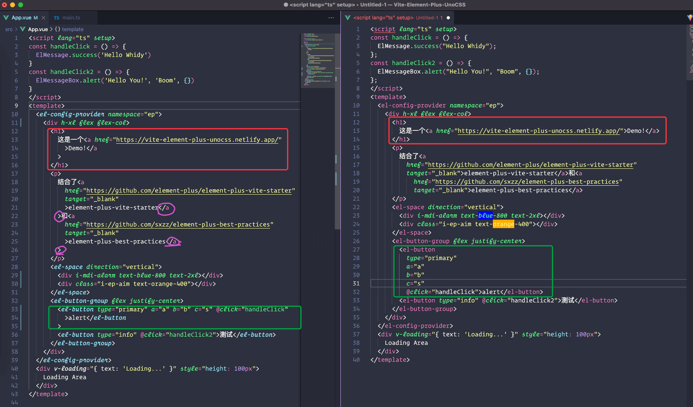

# Vite Element Plus UnoCSS

## 更新

2023 年 08 月 11 日

升级到 `typescript5` ，相关依赖升级。想要了解 `UnoCSS` ，可以看看我这个仓库[UnoCSS-Study-Examples](https://github.com/whidy/UnoCSS-Study-Examples)。

## 原文

> 参考<https://github.com/element-plus/element-plus-vite-starter>和<https://github.com/sxzz/element-plus-best-practices>配置进行优化搭建。

包含了自定义配色主题和各种自动导入。

但是我发现自动导入样式和组件，有时候好像样式会丢掉（频率很高）。插件用多了似乎并不是什么好事（虽然确实很方便）。如果你也发现了这种情况不要慌张，重启下 VSCode 试试看吧。

如果不需要自己配置主题，就把 scss 那些相关的预加载（ `vite.config.ts` ）和 `main.ts` 引用的样式移除吧。

演示：<https://vite-element-plus-unocss.netlify.app/>

## 备注

有一些其他的改动，完全根据个人喜好定制，做一些简单的说明。

### CSS Reset

~~该 Demo 使用了 `normalize.css` 的 reset 样式。【[WHY?](https://github.com/whidy/Vite-Element-Plus-UnoCSS/tree/with-tailwindcss-reset)】~~

> 当然，你必须了解 normalize 不是传统意义的 reset，如果有些地方不满意，你仍然需要 reset 一下（比如元素的内外边距，a 标签的下划线，列表的 style 等等）。

2023 年 01 月 16 日

我已修改为 reset.css 模式，因为我发现大部分项目的设计人员并不能很好的理解或者遵循浏览器自带样式的统一规范，使用了 `normalize.css` 或 `sanitize.css` ，反而还要再进行手动重置，在项目搭建初期，选择好基础样式尤为重要，因为个人原因，调整为传统的样式重置方案，使用 `eric-meyer.css` 或 `tailwind.css` 的 reset。

### ESLint

个人喜好明明白白的建项目，倒不是说之前 sxzz 的规则不好，大佬的规则中可以学到很多，然而我还是自己定制了适合自己的规则，想省事的话就不必要折腾了。



补充说明，需要安装的依赖：

```bash
pnpm i -D eslint @typescript-eslint/eslint-plugin @typescript-eslint/parser @vue/eslint-config-typescript eslint-plugin-vue
```

相关参考文档：

- [eslint-plugin-vue](https://eslint.vuejs.org/user-guide/#installation)
- [Linting your TypeScript Codebase](https://typescript-eslint.io/docs/linting/)
- [eslint-config-typescript for Vue](https://github.com/vuejs/eslint-config-typescript)
- [Building a Vue3 Typescript Environment with Vite](https://miyauchi.dev/posts/vite-vue3-typescript/)

关于项目自动引入后，ESLint 出现 `no-undef` 的错误，建议关闭该规则。本项目已关闭~

经研究，ESLint 规则无法 `--ignore-path` 多个文件，比如我希望同时忽略 `.gitignore` 和 `.eslintignore` ，似乎无法实现，尝试通过 `--ignore-pattern` 测试可以达到同样效果（参考 `package.json` 的 `script` 的 `lint` 命令）。

相关参考资料：

- [I get errors from the no-undef rule about global variables not being defined, even though there are no TypeScript errors](https://github.com/typescript-eslint/typescript-eslint/blob/main/docs/linting/TROUBLESHOOTING.md#i-get-errors-from-the-no-undef-rule-about-global-variables-not-being-defined-even-though-there-are-no-typescript-errors)
- [ESLint - Ignoring Code](https://eslint.org/docs/user-guide/configuring/ignoring-code)
- ["eslint --ignore-path" should accept multiple file paths](https://github.com/eslint/eslint/issues/9794)
- [Global module definition for typescript](https://stackoverflow.com/questions/63509978/global-module-definition-for-typescript)
